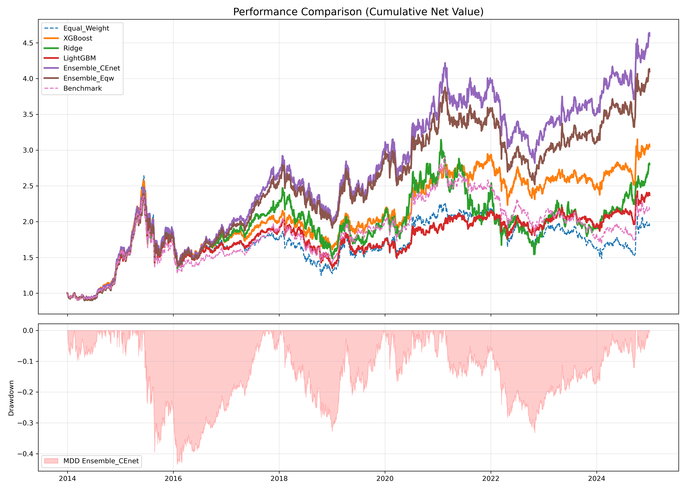
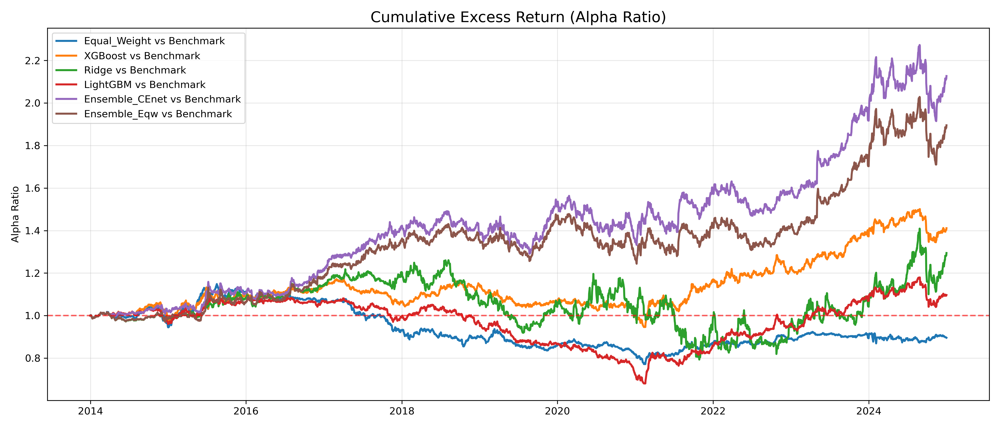
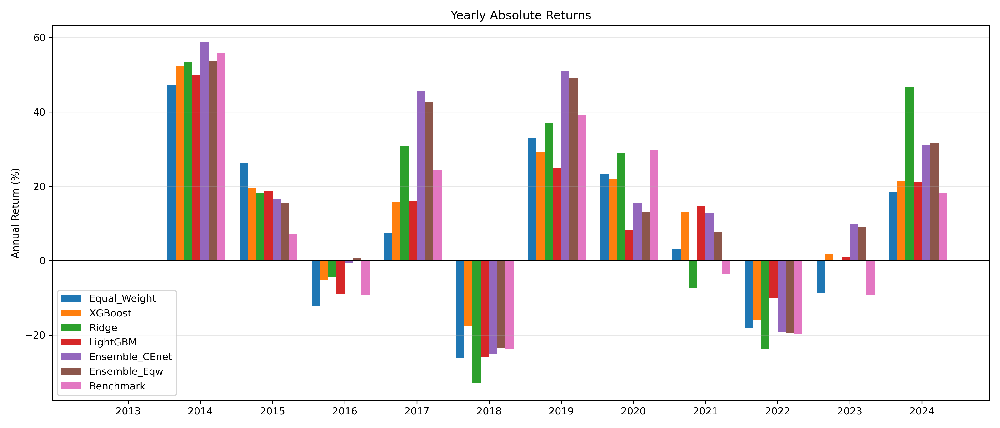
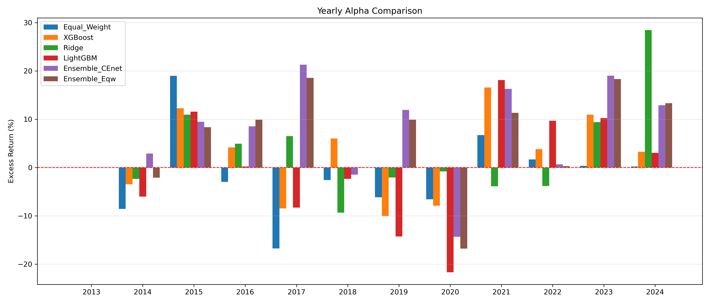
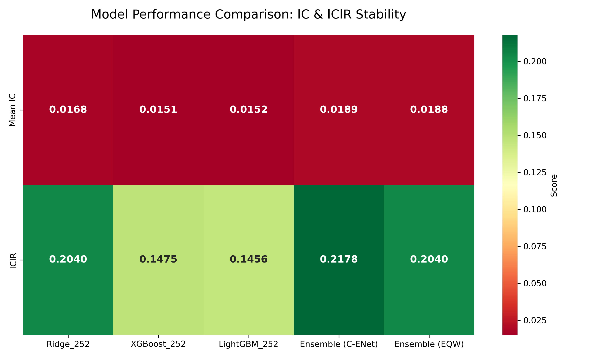

# CSI300-ML-Quant

Machine learning-based quantitative stock selection for the CSI 300 (沪深300) index.  
Six strategies are evaluated on a monthly rebalancing frequency against the CSI 300 benchmark over a 14-year out-of-sample period (2010–2024).

---

## Results

### Backtest Performance (Monthly Rebalancing, 2010–2024)

| Metric | Ridge | XGBoost | LightGBM | Ensemble CEnet | Ensemble Eqw | Benchmark |
|---|---|---|---|---|---|---|
| **Annual Return** | 9.80% | 10.67% | 8.16% | **14.87%** | 13.68% | 7.26% |
| Annual Volatility | 25.14% | 20.53% | 19.33% | 21.75% | 21.34% | 20.77% |
| **Sharpe Ratio** | 0.31 | 0.42 | 0.32 | **0.59** | 0.55 | 0.25 |
| **Information Ratio** | 0.16 | 0.49 | 0.13 | **0.78** | 0.68 | — |
| Max Drawdown | -50.98% | -46.18% | -44.80% | **-43.43%** | -42.35% | -46.06% |
| Annual Turnover | 1.40x | 1.42x | 1.36x | 1.15x | 1.11x | 0.00x |
| Mean IC | 0.0368 | 0.0177 | 0.0116 | 0.0368 | 0.0344 | — |
| ICIR | 1.4566 | 0.5643 | 0.3746 | 1.3596 | 1.2437 | — |
| Final Net Value | 2.80 | 3.05 | 2.37 | **4.60** | 4.10 | 2.16 |

### Out-of-Sample Predictive Power

| Model | R² (Out-of-Sample) | Mean IC |
|---|---|---|
| Ridge | 0.0437 | 0.0368 |
| XGBoost | 0.0515 | 0.0177 |
| LightGBM | 0.0517 | 0.0116 |
| Ensemble CEnet | 0.0486 | 0.0368 |
| Ensemble Eqw | 0.0502 | 0.0344 |

---

### Cumulative Performance



### Cumulative Excess Return vs Benchmark



### Yearly Absolute Returns



### Yearly Alpha vs Benchmark



### IC / ICIR Heatmap



---

## Repository Structure

```
codes/                      Jupyter notebooks (full pipeline) + factors_engineering.py
weights_diagnostic/
  paper_use/                Final monthly model weights and IC diagnostics
Figure/                     Backtest charts and model diagnostic plots
CSI300_CHANGE_WIND/         CSI300 constituent lists (2010–2024, Wind)
```

## Models

| Model | Description |
|---|---|
| Ridge | Ridge regression with MVO portfolio construction |
| XGBoost | Gradient boosting trees |
| LightGBM | LightGBM |
| LSTM + VSN | Long Short-Term Memory with Variable Selection Network |
| Ensemble CEnet | Cross-sectional neural ensemble |
| Ensemble Eqw | Equal-weighted combination of all models |

---

## Data

Raw data is sourced from **CSMAR** and **Wind** (commercial licences required) and is not included in this repository.  
CSI300 constituent membership files (2010–2024) are provided under `CSI300_CHANGE_WIND/`.
